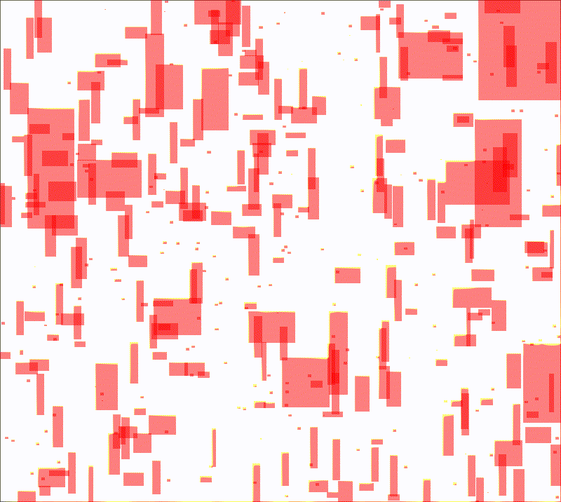
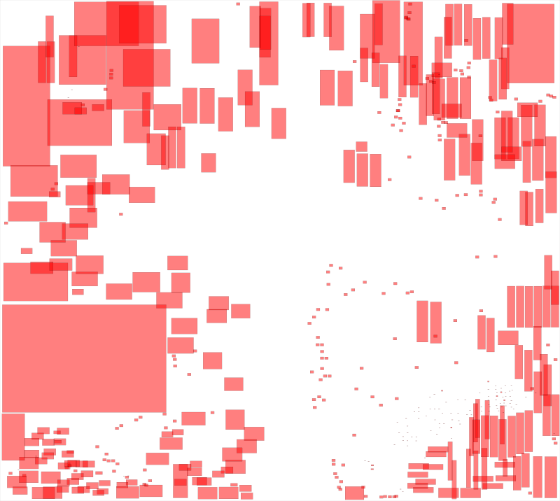
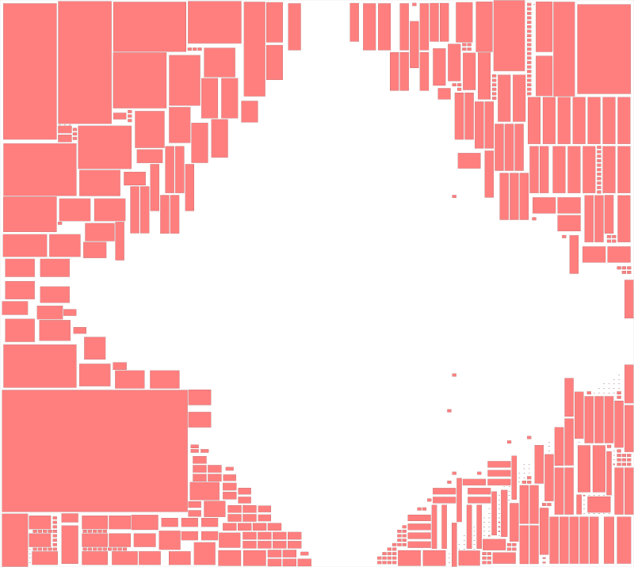
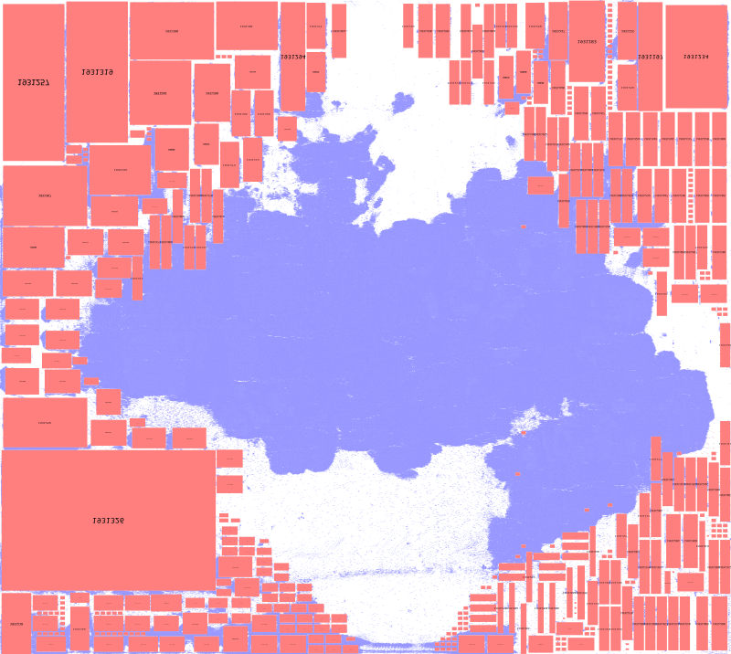

# DAC'26 FlowPlace: Flow Matching for Chip Placement

Official implementation of DAC'26 paper "FlowPlace: Flow Matching for Chip Placement"

## Introduction

<p align="center">
    
    
    
    
    
</p>

> Intuitively, all macros flow simultaneously through a velocity field encoded by a neural network.

Through domain-knowledge-integrated synthetic data generation, a flexible flow matching-based architecture, and hard-constraint sampling to eliminate overlaps in the final placement, FlowPlace achieves faster generation speed, overlap-free placements, and superior PPA metrics on both ICCAD2015 and OpenROAD benchmarks.


## Directory Structure
* [benchmark_utils](benchmark_utils) contains scripts for parsing and converting benchmarks in the DEF/LEF format (such as ICCAD2015) into PyG data format.
* [flow_matching](flow_matching) contains code for model architecture, training, and evaluation.
* [data-gen](data-gen) contains code for generating synthetic datasets.
* [datasets](datasets) stores the PyG datasets converted from benchmarks (e.g., ICCAD2015, OpenROAD).
* [scripts](scripts) contains scripts for generating data, training models, and evaluating models on benchmarks.

## Installation
### Environment Setup

Run the following commands to create and activate the conda environment:
```
conda env create -f environment.yaml
conda activate flowplace
```

### Real Circuit Benchmarks Preparation
We need to convert real-world circuit design formats into PyG graph data format. First, download the raw DEF/LEF files for the ICCAD2015 benchmarks from [here](https://drive.google.com/file/d/1xeauwLR9lOxnYvsK2JGPSY0INQh8VuE4/view?usp=sharing) and place them under the `benchmarks/iccad2015` directory.

(Optional) Download the raw bookshelf files for the ISPD2005 benchmarks from [here](https://www.cerc.utexas.edu/~zixuan/ispd2005dp.tar.xz) and place them under the `benchmarks/ispd2005` directory.

Download the pre-extracted OpenROAD benchmark dataset cache (containing macro and netlist information) from the [Release page](https://github.com/lamda-bbo/flowplace/releases) and place it under the `benchmark_cache` directory.

The expected directory structure is as follows:

```
benchmarks/
├── iccad2015/
│   ├── superblue1
│   ├── ...
├── ispd2005/
│   ├── adaptec1
│   ├── ...
benchmark_cache/
├── ariane133.pt
├── ...
```
Afterwards, please check and run the `parse_*.ipynb` notebooks in `benchmark_utils`. These notebooks convert the above files into PyG data format and save them under the `datasets/graph` directory.

## Quick Start

### Mask-guided Synthetic Dataset Generation
Run the following script to generate our training data:
```
bash scripts/gen_training_data.sh
```
The training dataset will be saved under `data-gen/outputs` with the following structure:
```
data-gen/outputs/
├── mask.61/
│   ├── *.pickle
│   ├── latest.ckpt
│   └── config.yaml
```
Generating the training data may take some time. We have therefore uploaded our pre-generated dataset to the [Release page](https://github.com/lamda-bbo/flowplace/releases); you can download and extract it to the corresponding directory to start model training immediately.

### Training the Flow Matching Model
Once training data is available under `data-gen/outputs`, run the following script to train the model:
```
bash scripts/train_flow_matching.sh
```
We provide pre-trained model weights on the [Release page](https://github.com/lamda-bbo/flowplace/releases); you can download and extract them to the corresponding directory to start evaluation immediately.

### Sampling with Hard Constraint

Once model training is complete, run the following script to evaluate the model on ICCAD2015. Please ensure that the benchmark files, the converted PyG graph data, and the model weight files are all in place:
```
bash scripts/test_flow_matching.sh
```
For detailed configuration options, please refer to the comments in the [script](scripts/test_flow_matching.sh), `flow_matching/models.py`, and the relevant config files.

## Evaluation

### Global Placement

We use [DREAMPlace 4.1.0](https://github.com/limbo018/DREAMPlace) for Global Placement.

For ISPD2005 and ICCAD2015 benchmarks, enable the `output_placement` option during evaluation to directly output placement files in DEF and bookshelf formats. You can then call DREAMPlace to place the remaining standard cells and obtain the HPWL.

For OpenROAD benchmarks, you will additionally need to convert the `*.pt` files output by the placement pipeline into DEF files using DREAMPlace. Please refer to the scripts, configurations, and notes in the `benchmark_utils/openroad` folder for guidance (some modifications may be required). This step should be performed within your compiled and configured DREAMPlace environment to transfer macro position information into the DEF file.

### PPA Evaluation

For ICCAD2015 benchmarks, we use the commercial tool to run `EarlyGlobalRoute` and report PPA metrics. We note that the original `tech.lef` (required for routing) download link from ICCAD2015 has expired; a backup is available on our [Release page](https://github.com/lamda-bbo/flowplace/releases). Due to requirements from our collaborators, we are unable to share the specific evaluation scripts.

For OpenROAD benchmarks, we use OpenROAD to run a complete design flow. The evaluation flow can be downloaded from the [Release page](https://github.com/lamda-bbo/flowplace/releases). We provide a Python script interface for convenient PPA evaluation of DEF files. Extract OpenROAD-flow-scripts into the `thirdparty` folder and run the following command:
```
python3 benchmark_utils/openroad/openroad_ppa_evaluator.py --def_path <path_to_def_file> --design <design_name>
```

To facilitate reproduction of our results, we provide the DEF files produced by FlowPlace on both ICCAD2015 and OpenROAD benchmarks on the [Release page](https://github.com/lamda-bbo/flowplace/releases).

## Acknowledgement

This codebase was developed with reference to [ChipDiffusion](https://github.com/vint-1/chipdiffusion), [MacroRegulator](https://github.com/lamda-bbo/macro-regulator), [MaskPlace](https://github.com/laiyao1/maskplace) and so on. We sincerely thank these works for their open-source contributions.

If you have any questions while reading or using this codebase, feel free to open an issue on [GitHub Issues](https://github.com/lamda-bbo/flowplace/issues).

If our work is helpful to your research, please consider citing our paper:

## Citation
```
@inproceedings{flowplace,
    author = {Peng Xie, Ke Xue, Yunqi Shi, Ruo-Tong Chen, Chengrui Gao, Siyuan Xu, Chenjian Ding, Mingxuan Yuan, Chao Qian.},
    title = {FlowPlace: Flow Matching for Chip Placement},
    booktitle = {Proceedings of the 63rd Design Automation Conference},
    year = {2026},
    address={Long Beach, CA, USA}
}
```


